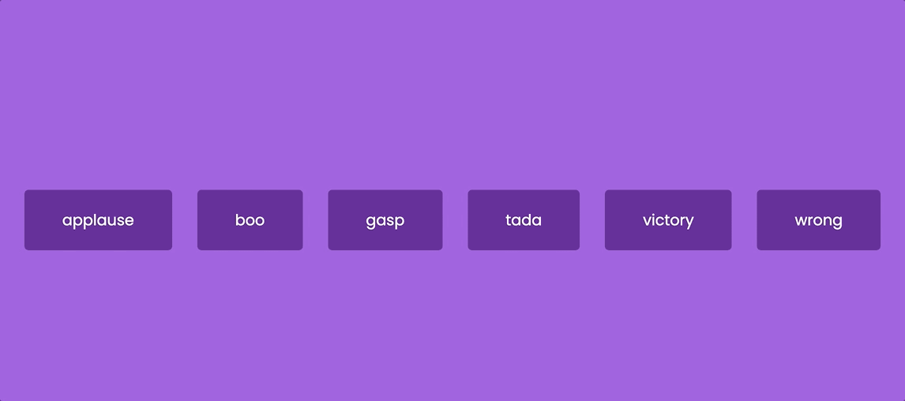

# 🎚 SoundBoard

A fun and intuitive **SoundBoard** built with **HTML**, **CSS**, and **JavaScript**.  
Play a variety of audio clips with a simple click—perfect for pranks, memes, or just adding personality to your site! 🎶🔊

---

## 🎥 Demo

*(Be sure to include a `demo.gif` to showcase your soundboard in action!)*

<p align="center">
  
</p>

---

## ✨ Features

-  Clickable buttons trigger different sound clips  
-  Support for multiple formats (e.g., MP3, WAV)  
-  Optional visual feedback—like button animation or highlighting  
-  Responsive design that works across devices  
-  Lightweight and framework-free—no extra dependencies!  

---

## 🛠 Technologies Used

-  **HTML** – for the layout and structure of the buttons  
-  **CSS** – for responsive design, hover effects, and visual polish  
-  **JavaScript** – for loading audio files and handling sound playback  

---

## 📦 How to Use

1. 📥 Clone the repository:
   ```bash
   git clone https://github.com/JehanAB/SoundBoard.git
